# Escuela Colombiana de Ingeniería Julio Garavito
## Arquitectura de Software – ARSW
### Laboratorio – Parte 2: BluePrints API con Seguridad JWT (OAuth 2.0)

**Integrantes:** Sebastian Castillejo - Rafael Moreno
Este laboratorio extiende la **Parte 1** ([Lab_P1_BluePrints_Java21_API](https://github.com/DECSIS-ECI/Lab_P1_BluePrints_Java21_API)) agregando **seguridad a la API** usando **Spring Boot 3, Java 21 y JWT (OAuth 2.0)**.  
El API se convierte en un **Resource Server** protegido por tokens Bearer firmados con **RS256**.  
Incluye un endpoint didáctico `/auth/login` que emite el token para facilitar las pruebas.

---

## Objetivos
- Implementar seguridad en servicios REST usando **OAuth2 Resource Server**.
- Configurar emisión y validación de **JWT**.
- Proteger endpoints con **roles y scopes** (`blueprints.read`, `blueprints.write`).
- Integrar la documentación de seguridad en **Swagger/OpenAPI**.

---

## Requisitos
- JDK 21
- Maven 3.9+
- Git

---

## Ejecución del proyecto
1. Clonar o descomprimir el proyecto:
   ```bash
   git clone https://github.com/DECSIS-ECI/Lab_P2_BluePrints_Java21_API_Security_JWT.git
   cd Lab_P2_BluePrints_Java21_API_Security_JWT
   ```
   ó si el profesor entrega el `.zip`, descomprimirlo y entrar en la carpeta.

2. Ejecutar con Maven:
   ```bash
   mvn -q -DskipTests spring-boot:run
   ```

3. Verificar que la aplicación levante en `http://localhost:8080`.

---

## Endpoints principales

### 1. Login (emite token)
```
POST http://localhost:8080/auth/login
Content-Type: application/json

{
  "username": "student",
  "password": "student123"
}
```
Respuesta:
```json
{
  "access_token": "eyJhbGciOiJSUzI1NiIsInR5cCI6IkpXVCJ9...",
  "token_type": "Bearer",
  "expires_in": 30
}
```

### 2. Consultar blueprints (requiere scope `blueprints.read`)
```
GET http://localhost:8080/api/blueprints
Authorization: Bearer <ACCESS_TOKEN>
```

### 3. Crear blueprint (requiere scope `blueprints.write`)
```
POST http://localhost:8080/api/blueprints
Authorization: Bearer <ACCESS_TOKEN>
Content-Type: application/json

{
  "name": "Nuevo Plano"
}
```

---

## Swagger UI
- URL: [http://localhost:8080/swagger-ui/index.html](http://localhost:8080/swagger-ui/index.html)
- Pulsa **Authorize**, ingresa el token en el formato:
  ```
  Bearer eyJhbGciOi...
  ```

---

## Estructura del proyecto
```
src/main/java/co/edu/eci/blueprints/
  ├── api/BlueprintController.java       # Endpoints protegidos
  ├── auth/AuthController.java           # Login didáctico para emitir tokens
  ├── config/OpenApiConfig.java          # Configuración Swagger + JWT
  └── security/
       ├── SecurityConfig.java
       ├── MethodSecurityConfig.java
       ├── JwtKeyProvider.java
       ├── InMemoryUserService.java
       └── RsaKeyProperties.java
src/main/resources/
  └── application.yml
```

---

## Actividades propuestas
1. Revisar el código de configuración de seguridad (`SecurityConfig`) e identificar cómo se definen los endpoints públicos y protegidos.

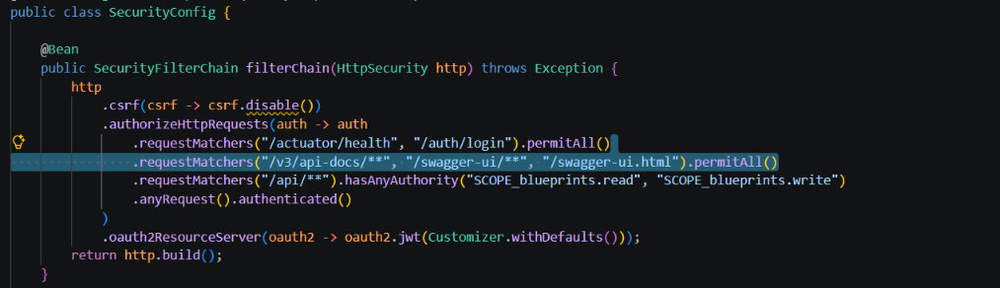

en esta parte tenemos varias cosas, por una parte tenemos en la linea 26 todo lo relacionado con las rutas publicas las cuales no requiren uso de token como por ejemplo el de login y el de health

tambien tenemos en la liena 27, todo lo relacionado con las rutas del swagger para que se peuden abrir la documentacion sin token

en la linea 28 ya tenemos lo de la rutas proteguidas en done hay que tener el token y el anyRequest().authenticated() lo que hace es que Cualquier otra ruta pide estar autenticado. Es una red de seguridad para lo que no se nombró arriba

finalmente el oauth2ResourceServer(...jwt), Convierte la app en un Resource Server: en cada petición lee Authorization: Bearer tiken y valida la firma RS256 y la fecha de expiración

2. Explorar el flujo de login y analizar las claims del JWT emitido.

# flujo del login

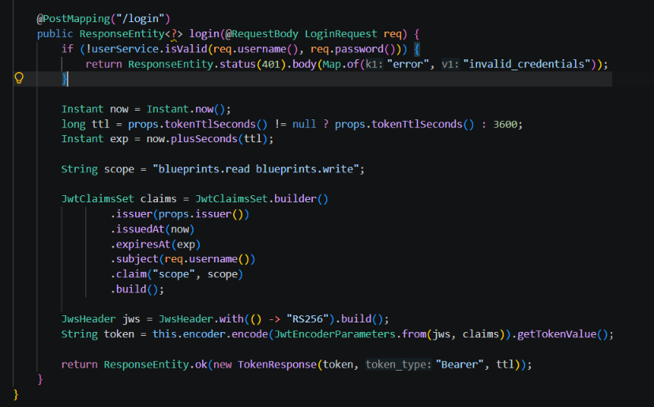

1) para esta parte lo que prime se hace es que elcliente manda usuario y contraseña a POST /auth/login, que es pública 

2) luego se validan las credenciales con InMemoryUserService.java, pero en este caso hay dos usuarios en memoria, student/student123 y assistant/assistant123, y las contraseñas se guardan con BCrypt. Si no coinciden devuveve un 401 {"error":"invalid_credentials"}.

3) luego se  arman los claims: emisor, fecha de emisión, fecha de expiración, usuario que hablo en el punto anterior

4) ya con esto se firma el token con RS256, usando la llave privada RSA que genera JwtKeyProvider

5) le devolvemos { access_token, token_type: "Bearer", expires_in: 3600 }

6) finalmente el cliente manda el token en cada petición con Authorization: Bearer token. El servidor verifica la firma con la llave pública y revisa que no esté vencido


# analizar claims del JWT emitido

Un JWT tiene 3 partes separadas por puntos: `HEADER.PAYLOAD.FIRMA`, cada una codificada en Base64URL. Estas partes no se arman en una sola clase, sino que cada una se construye en un lugar distinto:

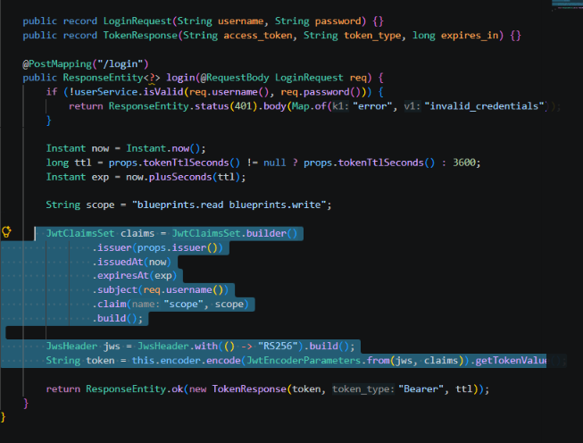

En el `AuthController` es donde se arma el token. Con `JwtClaimsSet.builder()` se definen los claims del payload:
- `iss` (issuer): quién emite el token, sale de `props.issuer()`.
- `iat` (issued at): la fecha en que se emitió, `Instant.now()`.
- `exp` (expiration): la fecha en que vence, que es `now + ttl`.
- `sub` (subject): el usuario que hizo login, `req.username()`.
- `scope`: los permisos del token, que salen de `userService.scopesOf(req.username())` según el usuario (ver actividad 3).

Después con `JwsHeader.with(() -> "RS256")` se arma el header, que indica que el algoritmo de firma es RS256 (RSA + SHA-256), y con `encoder.encode(...)` se firma y se obtiene el token final.

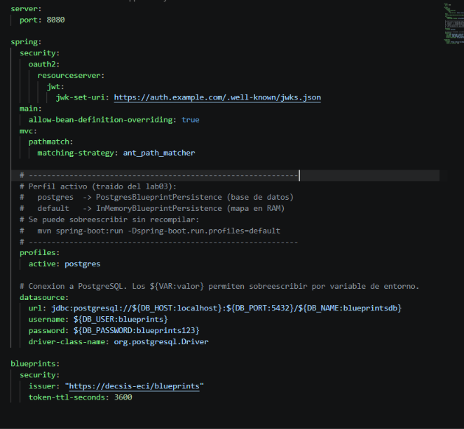

En el application.yml están los valores que usa el token: issuer: https://decsis-eci/blueprints, que es lo que termina en el claim iss, y token-ttl-seconds: 3600, que es cuánto dura el token (1 hora). Por eso en el token siempre se cumple que exp - iat = 3600.

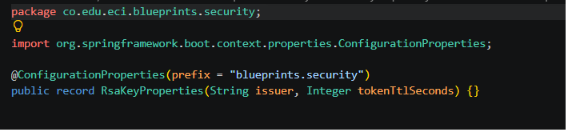

RsaKeyProperties es el record que lee esos valores del application.yml gracias a @ConfigurationProperties(prefix = blueprints.security), y así el AuthController los puede usar con props.issuer() y props.tokenTtlSeconds().

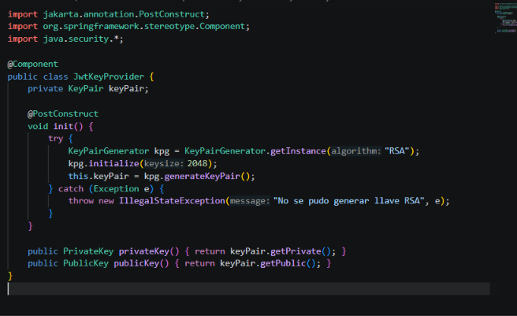

JwtKeyProvider genera el par de llaves RSA de 2048 bits al arrancar la app (@PostConstruct). La llave privada sirve para firmar y la pública para verificar. Como se generan cada vez que arranca, si se reinicia la app los tokens viejos dejan de servir porque la firma ya no coincide.

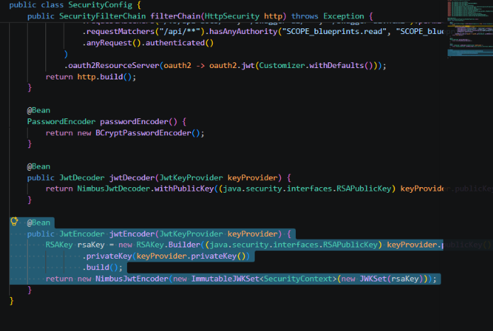

En SecurityConfig el bean jwtEncoder usa la llave privada del JwtKeyProvider para firmar los tokens. Este es el encoder que usa el AuthController al hacer login.

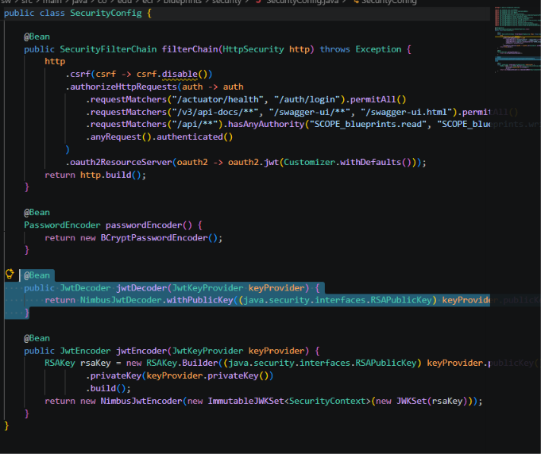

En SecurityConfig el bean jwtDecoder usa la llave pública para validar el token en cada petición. Si alguien modifica el payload (por ejemplo cambia el sub o el scope), la firma ya no coincide y el servidor responde 401. Igual si el token ya pasó su exp.

Algo importante es que el payload del JWT no está cifrado, solo codificado, entonces cualquiera lo puede leer (por ejemplo en jwt.io). Por eso no se deben poner contraseñas ni datos sensibles dentro del token; la seguridad está en la firma, que evita que lo modifiquen.

AuthController arma el token, SecurityConfig lo firma y lo valida, y JwtKeyProvider pone las llaves.


3. Extender los scopes (`blueprints.read`, `blueprints.write`) para controlar otros endpoints de la API, del laboratorio P1 trabajado.

### Cambios en BlueprintsAPIController

se cambió el paquete de edu.eci.arsw.blueprints a co.edu.eci.blueprints, que es el paquete base del lab04; si no se cambiaba no encontraba las clases porque solo escanea dentro del paquete de la clase principal

En BlueprintsAPIController se hicieron estos cambios:

1. Se importó org.springframework.security.access.prepost.PreAuthorize.
2. A cada endpoint se le agregó @PreAuthorize, que revisa los scopes del token antes de ejecutar el método. Esto funciona porque MethodSecurityConfig tiene @EnableMethodSecurity. Los endpoints de consulta exigen blueprints.read y los que modifican datos exigen blueprints.write

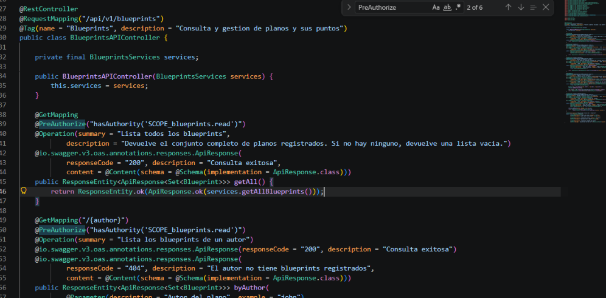

| Endpoint | Qué hace | Anotación |
|---|---|---|
| GET /api/v1/blueprints | Lista todos los blueprints | @PreAuthorize(hasAuthority('SCOPE_blueprints.read')) |
| GET /api/v1/blueprints/{author} | Lista los blueprints de un autor | @PreAuthorize(hasAuthority('SCOPE_blueprints.read')) |
| GET /api/v1/blueprints/{author}/{bpname} | Obtiene un blueprint | @PreAuthorize(hasAuthority('SCOPE_blueprints.read')) |
| POST /api/v1/blueprints | Crea un blueprint | @PreAuthorize(hasAuthority('SCOPE_blueprints.write')) |
| PUT /api/v1/blueprints/{author}/{bpname}/points | Agrega un punto a un blueprint | @PreAuthorize(hasAuthority('SCOPE_blueprints.write')) |

Se usa SCOPE_ porque Spring toma cada valor del claim scope del JWT y le agrega ese prefijo, entonces blueprints.read del token queda como la autoridad SCOPE_blueprints.read.

Con esto la seguridad queda en dos niveles: en SecurityConfig la regla /api/\*\* deja pasar a quien tenga algún scope, y en el controlador @PreAuthorize define exactamente qué scope necesita cada endpoint.

aparte de eso se cambios dos cosas mas para que quedara completo

- en GlobalExceptionHandler se agregó un manejador para AccessDeniedException que responde 403 insufficient scope
- en InMemoryUserService y AuthController, todos los usuarios recibían los dos scopes ahora cada usuario tiene sus propios scopes y el login los pone en el token

| Usuario | Scopes | Puede |
|---|---|---|
| student / student123 | blueprints.read blueprints.write | Consultar y crear |
| assistant / assistant123 | blueprints.read | Solo consultar |

### Pruebas

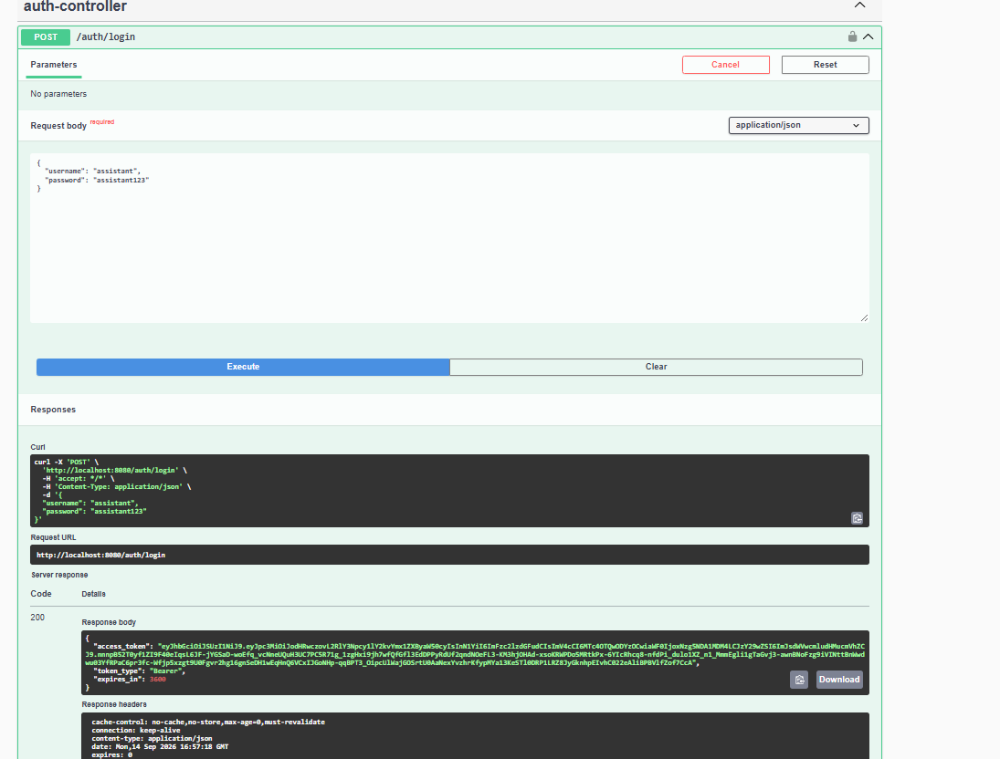

Se hace login en POST /auth/login con el usuario assistant / assistant123. La respuesta es 200 con el access_token, token_type: Bearer y expires_in: 3600. Este token solo lleva el scope blueprints.read, entonces este usuario solo debería poder consultar.

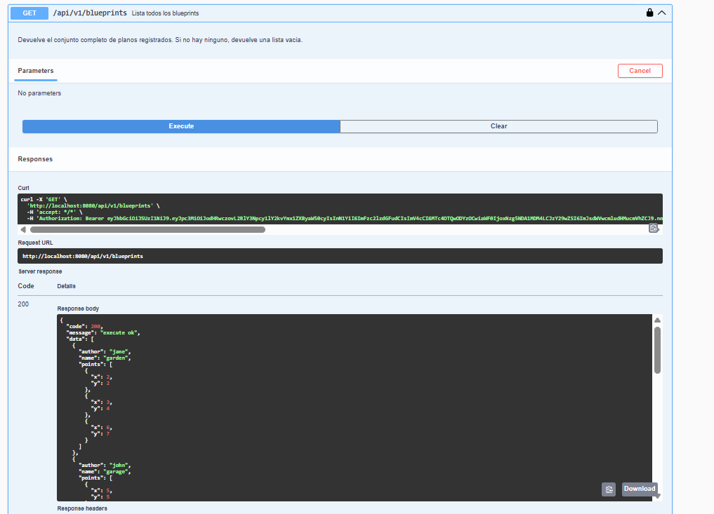

Con el token de assistant se consulta GET /api/v1/blueprints. En el cURL se ve que se envía la cabecera Authorization: Bearer ... y la respuesta es 200 execute ok con la lista de blueprints, porque este endpoint exige blueprints.read y el token sí lo tiene.

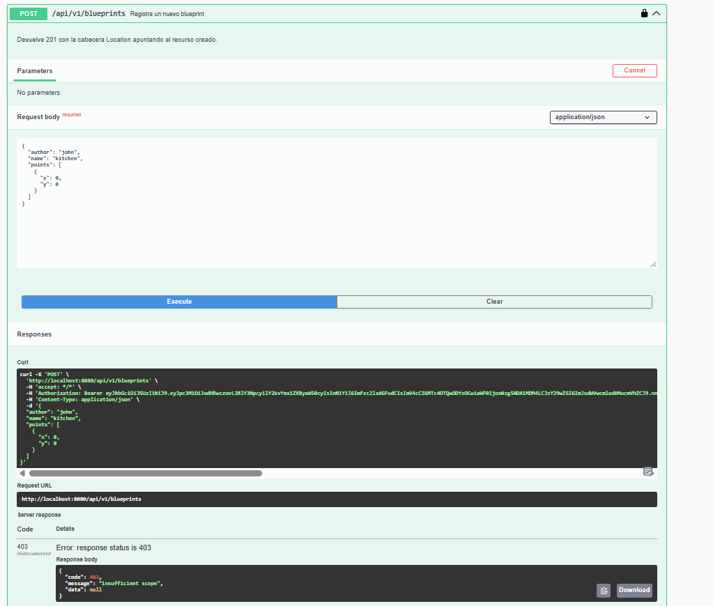

Con el mismo token de assistant se intenta crear un blueprint con POST /api/v1/blueprints. La respuesta es 403 insufficient scope: el token es válido (por eso no es 401), pero no tiene el scope blueprints.write que exige este endpoint, entonces @PreAuthorize bloquea la petición antes de que se ejecute el método y no se crea nada.

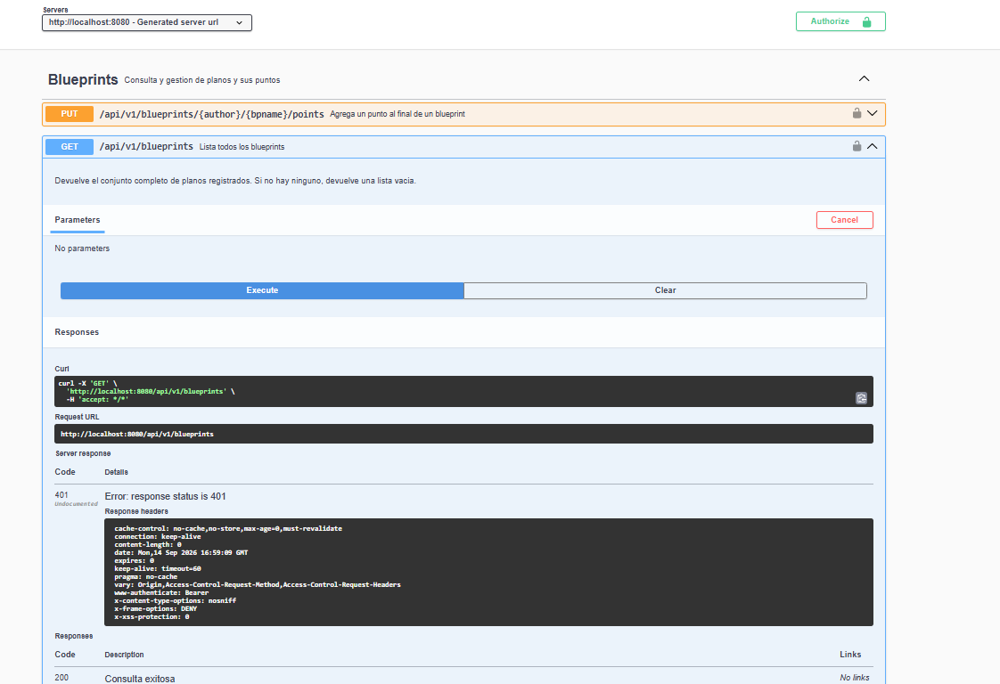

Por último se hace GET /api/v1/blueprints sin autorizarse en Swagger (el candado aparece abierto y el cURL no lleva la cabecera Authorization). La respuesta es 401 con la cabecera www-authenticate: Bearer, porque la ruta está protegida y no se mandó ningún token.

Con estas pruebas se ve la diferencia entre los códigos:
- 401: no hay token, o el token no es válido o ya venció (no se sabe quién es).
- 403: el token es válido, pero no tiene el permiso que pide el endpoint (se sabe quién es, pero no puede hacerlo).


4. Modificar el tiempo de expiración del token y observar el efecto.

El tiempo de vida no está quemado en el `AuthController`, sale de `application.yml`:

```
blueprints:
  security:
    issuer: "https://decsis-eci/blueprints"
    token-ttl-seconds: 30
```

estaba en 3600 (1 hora) y lo bajamos a 30 segundos para poder ver el vencimiento sin quedarnos esperando una hora. `RsaKeyProperties` lee ese valor por el prefix `blueprints.security`, y en el login se usa así:

```
long ttl = props.tokenTtlSeconds() != null ? props.tokenTtlSeconds() : 3600;
Instant exp = now.plusSeconds(ttl);
```

ese `ttl` se pone en el claim `exp` y también en el `expires_in` de la respuesta, entonces si se cambia el yml se cambia todo junto. El `JwtDecoder` no hay que tocarlo: él solo mira si `exp` ya pasó.

# pruebas

1) `POST /auth/login` con student / student123. Antes `expires_in` venía en 3600, ahora sale 30:

```json
{
  "access_token": "eyJhbGciOiJSUzI1NiJ9...",
  "token_type": "Bearer",
  "expires_in": 30
}
```

2) el payload (la parte de en medio del JWT, en jwt.io) queda:

```json
{
  "iss": "https://decsis-eci/blueprints",
  "sub": "student",
  "exp": 1789707844,
  "iat": 1789707814,
  "scope": "blueprints.read blueprints.write"
}
```

`exp - iat = 30`, o sea que el cambio del yml sí quedó dentro del token, no solo en el JSON del login.

3) con ese token todavía fresco, `GET /api/v1/blueprints` con `Authorization: Bearer ...` responde 200 `execute ok` y la lista de john / jane. El token es válido, no hay misterio.

4) esperamos un poco más de 30 segundos y repetimos el mismo GET, con el mismo token, sin hacer login otra vez. Acá nos extrañó: a los 35 segundos todavía daba 200. Resulta que el `NimbusJwtDecoder` de Spring trae 60 segundos de holgura (clock skew) por si el reloj del servidor y el del emisor no coinciden exacto. Como el ttl es 30, en la práctica el token aguanta más o menos 90 segundos.

cuando ya pasó ese rato (esperamos ~95 s) el GET ya no pasa: 401, sin body, y en la cabecera:

```
WWW-Authenticate: Bearer error="invalid_token", error_description="An error occurred while attempting to decode the Jwt: Jwt expired at 2026-09-18T05:04:04Z"
```

o sea Spring ni siquiera entra al controlador ni mira el scope. El token ya no sirve. Para seguir hay que hacer login otra vez y sacar uno nuevo.

esto es distinto al 403 del punto 3: allá el token estaba bien firmado y vigente, solo le faltaba `blueprints.write`. Acá el token ya venció, entonces es 401, igual que si no se mandara nada.


5. Documentar en Swagger los endpoints de autenticación y de negocio.

`OpenApiConfig` ya tenía el esquema `bearer-jwt` global, por eso en Swagger sale el botón Authorize y todos los endpoints de `/api/v1/blueprints` aparecen con candado. Eso cubre el negocio. Lo que no estaba era el login.

en `AuthController` se agregó:

- `@Tag(name = "Auth")` para que en swagger-ui salga un grupo aparte, no mezclado con los planos
- `@Operation` en `POST /auth/login`, con 200 y 401
- `@Schema` en `LoginRequest` y `TokenResponse` (username student, password student123) para no tener que adivinar el body
- `@SecurityRequirements` vacío en el login. Si no se pone, el candado global también se aplica al endpoint que justamente da el token, y toca autorizarse para poder autorizarse, que no tiene sentido. En el openapi queda `"security": []` en `/auth/login`

el stub de `BlueprintController` (`/api/blueprints`, el de la plantilla del lab) se marcó con `@Hidden`. Si no, en swagger aparecen dos APIs de planos y confunde: la que se usa es `/api/v1/blueprints`.

al abrir http://localhost:8080/swagger-ui/index.html quedan dos tags: Auth y Blueprints. Auth tiene el `POST /auth/login` sin candado. Blueprints tiene los GET / POST / PUT del lab P1 con candado.

el flujo que usamos para probar desde ahí:

1. Expandir Auth, Try it out, mandar student / student123. Sale 200 con `access_token`, `token_type: Bearer` y `expires_in: 30`.
2. Copiar el `access_token`, pulsar Authorize arriba y pegarlo (swagger ya pone Bearer).
3. Ir a `GET /api/v1/blueprints`, Try it out, Execute. El curl lleva `Authorization: Bearer ...` y responde 200 con los planos.

si se espera demasiado (por el ttl de 30 s más los 60 s de holgura) el mismo Execute ya da 401 Jwt expired, y hay que repetir el login. Por eso para las pruebas de swagger conviene sacar el token y usarlo de una.

con esto login y negocio quedan documentados en el mismo swagger, y se puede hacer todo el recorrido sin postman.

---

## Lecturas recomendadas
- [Spring Security Reference – OAuth2 Resource Server](https://docs.spring.io/spring-security/reference/servlet/oauth2/resource-server/index.html)
- [Spring Boot – Securing Web Applications](https://spring.io/guides/gs/securing-web/)
- [JSON Web Tokens – jwt.io](https://jwt.io/introduction)

---

## Licencia
Proyecto educativo con fines académicos – Escuela Colombiana de Ingeniería Julio Garavito.
